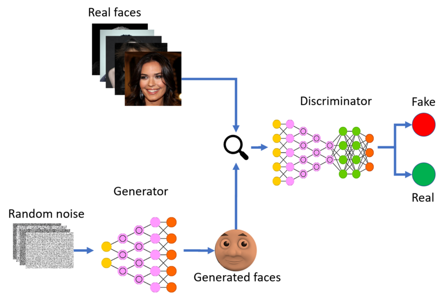

# Face-Generation
In this project, we will use pytorch to create generative adversarial networks to generate new images of faces. We will be using the CelebFaces Attributes 
Dataset (CelebA) to train your adversarial network. [To download the dataset click here](https://s3.amazonaws.com/video.udacity-data.com/topher/2018/November/5be7eb6f_processed-celeba-small/processed-celeba-small.zip). This is a zip file that you'll need to extract in the 
home directory of this notebook for further loading and processing. After extracting the data, you should be left with a directory of data
processed_celeba_small/.

### How training happens


#Dependencies
Download the latest version of miniconda that matches your system.
Install miniconda on your machine. Detailed instructions:  
+  **Linux:** http://conda.pydata.org/docs/install/quick.html#linux-miniconda-install  
+   **Mac:**  http://conda.pydata.org/docs/install/quick.html#os-x-miniconda-install  
+  **Windows:** http://conda.pydata.org/docs/install/quick.html#windows-miniconda-install   
  
 For Windows users, these following commands need to be executed from the Anaconda prompt  as opposed to a Windows terminal window. For 
 Mac, a normal terminal window will work.

Git and version control
These instructions also assume you have git installed for working with Github from a terminal window, but if you do not, you can download
that first with the command:
`conda install git`

Create (and activate) a new environment, named deep-learning with Python 3.6. If prompted to proceed with the install (Proceed [y]/n)
type y.

Linux or Mac:
```
conda create -n deep-learning python=3.6
source activate deep-learning
``` 

Windows:
```
conda create --name deep-learning python=3.6
activate deep-learning
```  

To install all the requirements copy the requirements in a blank text document name it as requirement.txt 

Requirements to run the project
+  opencv-python
+  jupyter
+  matplotlib
+  pandas
+  numpy
+  pillow
+  scipy
+  tqdm
+  scikit-learn
+  scikit-image
+  seaborn
+  h5py
+  ipykernel
+  bokeh
+  pickleshare
+  torch  
 
Install a few required pip packages, which are specified in the requirements text file .

```
pip install -r requirements.txt
```
Now you can start working on the project use jupyter to either load a notebook or create a new untitled norebook 

### Final Result


